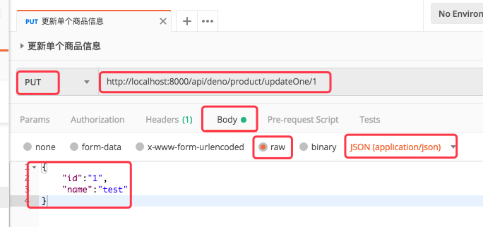

## deno_simple-rest-api

基于 deno（v1.0.1），无数据库，简易的 RestAPI

## 启动

```bash
deno run --allow-net server.ts
```

## 调试

查询所有商品信息：GET http://localhost:8000/api/deno/product/list  
查询单个商品信息：GET http://localhost:8000/api/deno/product/findOne/1  
添加单个商品信息：POST http://localhost:8000/api/deno/product/addOne  
更新单个商品信息：PUT http://localhost:8000/api/deno/product/updateOne/  
删除单个商品信息：DELETE http://localhost:8000/api/deno/product/deleteOne/1  

建议使用 postman 调试，以 更新单个商品信息 为例 


